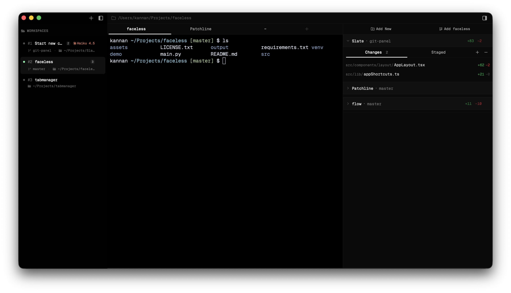
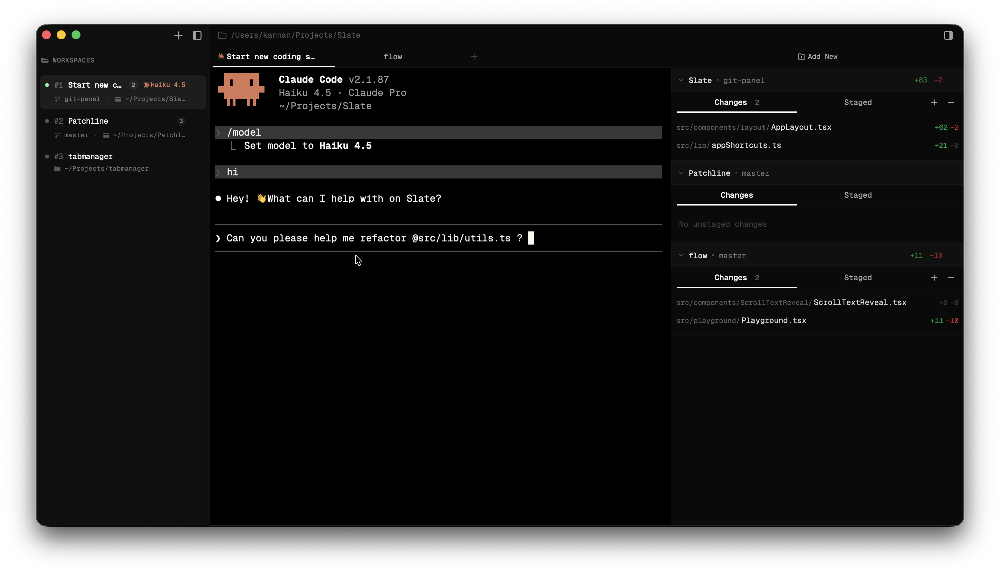
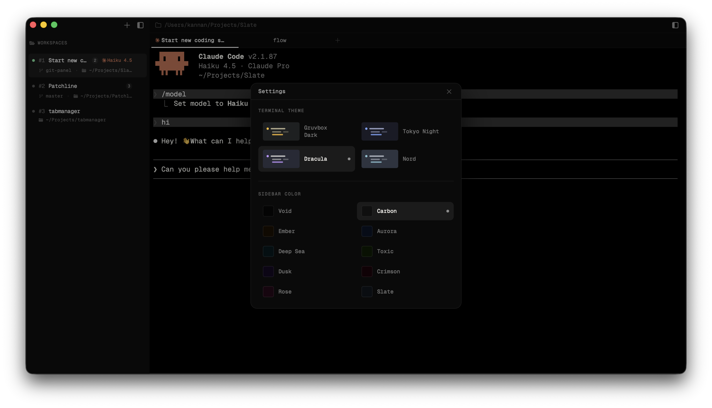
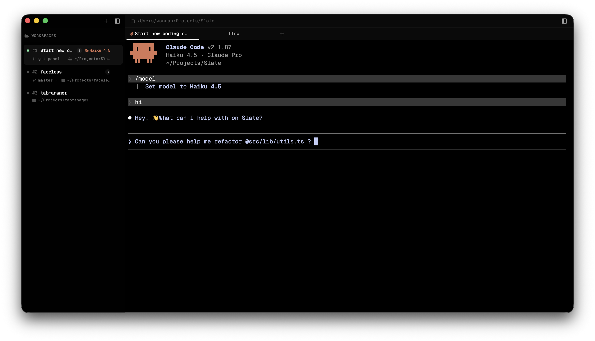

<div align="center">

<br />

# Blackslate

**The terminal built for the agentic developer.**

A macOS terminal that works like every great terminal you've used — fast, minimal, out of the way. Then Claude Code starts, and everything changes.

<br />

[](https://www.apple.com/macos/)
[](https://tauri.app)
[](https://react.dev)
[](LICENSE)

<br />









<br />

</div>

---

## The problem

Every terminal treats the agent as just another process printing to a pipe. You spawn Claude Code, it starts working, and now you're lost — scrolling back through walls of output trying to remember which session is doing what, what files it touched, where it is in the task, which directory that was.

The tools are powerful. The workspace isn't built for them.

---

## What Blackslate does

Blackslate wraps the terminal in an intelligent workspace layer. It doesn't replace the shell — it reads it. When Claude Code is running, the sidebar surfaces what matters: which session is active, what directory you're in, the git branch, the project stack, and a live agent indicator. No more hunting through tabs.

The philosophy is deliberate: **augment at the UI/UX layer, not at the protocol layer.** PTY, shell, and process management are solved problems. The unsolved problem is the experience of working *alongside* an agent — and that's entirely a UI/UX problem.

---

## Vision

Blackslate's near-term goal is the best Claude Code–native terminal on macOS.

The longer-term goal is bigger: **a full-stack developer workspace that lives inside the terminal.** An integrated code editor, an agent action timeline, inline diffs, pane splits — everything you need to run a complete read-edit-run loop without ever leaving the surface where the agent is working. Not Electron. Not a browser tab. A native macOS application built from the ground up for the workflow that's actually happening in 2025.

---

## Features

### Workspaces & tabs

- **Multiple workspaces** — each workspace is a row in the sidebar; **`⌘1`–`⌘9`** jumps to workspace 1–9 in order
- **Horizontal tabs per workspace** — several terminal sessions inside one workspace; **`⌘⌥1`–`⌘⌥9`** selects tab 1–9, **`⌘[`** / **`⌘]`** previous or next tab (wraps)
- **PTYs stay alive** — every tab keeps its own PTY; inactive tabs stay mounted so switching is instant with no shell state loss

### Git changes pane

- **Right-side git panel** — track multiple repositories, see **Changes** / **Staged** per repo, line stats, and stage or discard from the UI (**`⌘L`** toggles the panel)
- **Branch and status** — current branch per repo via `git`; status is polled while the panel is open

### Terminal

- **WebGL-accelerated rendering** — xterm.js with the WebGL backend, the same renderer powering VS Code's integrated terminal
- **Live cwd tracking** — OSC 7 shell integration injected automatically via `ZDOTDIR` (zsh) and `PROMPT_COMMAND` (bash), without touching your dotfiles
- **Git awareness in the sidebar** — branch name per session when the cwd is inside a repo
- **Project stack detection** — Rust, Go, Node, React, Python and more detected from project files and shown as badges per session
- **Font size control** — `⌘=` / `⌘-` resize live across all sessions

### Keyboard shortcuts

| Shortcut | Action |
|----------|--------|
| `⌘N` | New workspace |
| `⌘T` | New tab in the active workspace |
| `⌘W` / `⌘Q` | Close active tab (or workspace if it’s the last tab) |
| `⌘1`–`⌘9` | Switch to workspace 1–9 |
| `⌘⌥1`–`⌘⌥9` | Switch to tab 1–9 in the active workspace |
| `⌘[` / `⌘]` | Previous / next tab in the active workspace |
| `⌘B` | Toggle sidebar |
| `⌘L` | Toggle git changes pane |
| `⌘=` / `⌘-` | Zoom terminal font |

Settings (terminal theme & sidebar colour) — **Blackslate → Preferences…** from the menu bar (`⌘,` on macOS).

### Agent Workspace

- **Claude Code detection** — Blackslate polls the PTY's foreground process group and walks the shell's process tree to detect when `claude` is running, shown as a live indicator per session
- **Persistent session sidebar** — directory, full path, git branch, dirty status, and project stack at a glance for every open session
- **Session persistence** — inactive sessions stay mounted with `visibility: hidden`; the PTY keeps running, scroll history is intact, no reconnection on switch

### Personalisation

- **Terminal themes** — Gruvbox Dark, Tokyo Night, Dracula, Nord — switchable live via `⌘,`
- **Sidebar colours** — ten distinct dark palettes (Void, Carbon, Ember, Aurora, Deep Sea, Toxic, Dusk, Crimson, Rose, Slate) designed to pair with each terminal theme
- **More customisation coming** — font family, font size, shell path, and additional themes on the roadmap

### On the Roadmap

| | Feature |
|---|---|
| 🔲 | **Agent action timeline** — structured feed of tool calls and file operations as Claude Code works |
| 🔲 | **Inline diff viewer** — file edits as side-by-side diffs without leaving the terminal |
| 🔲 | **Integrated code editor** — edit files inside Blackslate; the agent's loop never leaves |
| 🔲 | **Enhanced agent status** — expand the existing Claude indicator into thinking / tool running / waiting states |
| 🔲 | **Pane splits** — vertical and horizontal splits, multiple terminals in one window |
| 🔲 | **Session renaming** — double-click to name a session |
| 🔲 | **Extended settings** — font family, shell path, and additional colour schemes |

---

## Tech stack

| Layer | Technology |
|---|---|
| Application shell | Tauri 2 (Rust) |
| Frontend | React 19 + TypeScript + Vite 7 |
| Styling | Tailwind CSS v4 + shadcn/ui |
| Terminal renderer | xterm.js + WebGL addon |
| State | Zustand |
| PTY backend | portable-pty (Rust) |
| Async runtime | Tokio |
| Process detection | macOS `proc_pidinfo` / `sysinfo` |

The Rust backend is infrastructure only — PTY lifecycle, process detection, git and project metadata. All parsing, state, and UX logic lives in the React frontend. Blackslate makes no Anthropic API calls; it reads Claude Code's output from the PTY stream.

---

## Getting started

### Prerequisites

- macOS 13 or later
- [Rust](https://rustup.rs) stable toolchain
- [Bun](https://bun.sh) (or Node.js 20+)
- Xcode Command Line Tools: `xcode-select --install`

### Clone the repository

```bash
git clone https://github.com/your-org/blackslate.git
cd blackslate
```

### Build instructions

**Install dependencies**

```bash
bun install
```

**Run locally** — development build with hot reload (Vite + Tauri). The first run compiles the Rust backend (about a minute); later runs are incremental.

```bash
bun tauri dev
```

**Create a release build** — produces the macOS `.app` and a `.dmg` installer (artifacts under `src-tauri/target/release/bundle/`).

```bash
bun tauri build
```

---

## Project structure

```
blackslate/
├── src/                           # React frontend
│   ├── components/
│   │   ├── layout/                # AppLayout — titlebar, sidebar, main pane
│   │   ├── sidebar/               # AppSidebar — session list + metadata
│   │   ├── terminal/              # TerminalPane, TerminalView
│   │   └── settings/              # SettingsDialog
│   ├── hooks/
│   │   └── usePty.ts              # PTY ↔ xterm.js bridge + OSC 7 parser
│   ├── store/
│   │   ├── sessions.ts            # Zustand session store
│   │   └── settings.ts            # Preferences — theme, sidebar colour, font
│   └── lib/
│       ├── terminalThemes.ts      # xterm.js colour theme definitions
│       └── appShortcuts.ts        # Global keyboard shortcut registry
│
└── src-tauri/src/                 # Rust backend
    └── terminal/
        ├── session/               # PtySession, shell cmd builder, PTY reader task
        ├── manager.rs             # SessionManager — RwLock concurrent map
        ├── commands/              # Tauri IPC command handlers
        └── agent_detect/          # Claude Code process-tree detection
```

---

## Architecture notes

**Shell integration without dotfile mutation** — OSC 7 cwd reporting is injected at session creation via a temporary `ZDOTDIR` override (zsh) and a `PROMPT_COMMAND` prefix (bash). Your dotfiles are never touched.

**Agent detection** — `tcgetpgrp` on the PTY master returns the foreground process group; `sysinfo` walks the tree from the shell PID. Both paths are checked, so detection works whether `claude` is a foreground job or a nested subprocess.

**Event coalescing** — the PTY reader accumulates output for up to 4 ms or 8 KB before emitting a Tauri IPC event. This keeps throughput high during agent output bursts without adding perceptible latency in interactive use.

**No xterm.js unmounting** — all `TerminalPane` instances stay mounted at all times. Inactive sessions are hidden with `visibility: hidden`, so xterm can keep measuring container dimensions via `ResizeObserver`. Switching sessions is instant with no PTY state loss.

**PTY concurrency** — `SessionManager` uses `RwLock<HashMap<String, Arc<PtySession>>>` so writes, resizes, and agent checks across concurrent panes proceed in parallel without contending on a global lock.

---

## Contributing

Blackslate is in active early development. Issues and pull requests are welcome.

A few hard constraints that keep the architecture clean:

- **xterm.js owns all terminal rendering** — never write terminal output to the React DOM
- **All `TerminalPane` instances stay mounted** — use `visibility: hidden` for inactive sessions, never `display: none`
- **No Anthropic API calls** — Blackslate reads Claude Code's PTY output; it does not call any AI API itself
- **Business logic belongs in the frontend** — the Rust backend is infrastructure only

---

## License

MIT
