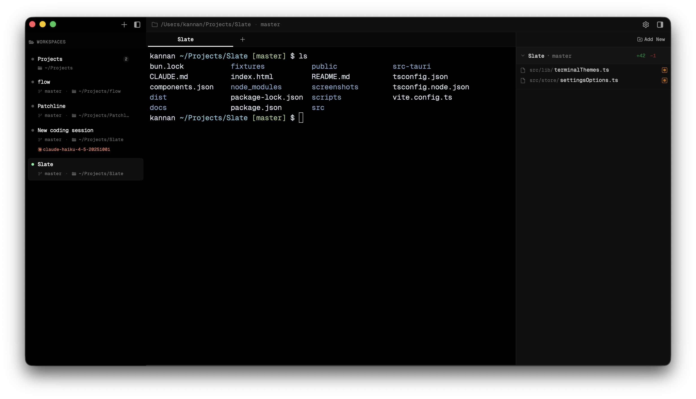
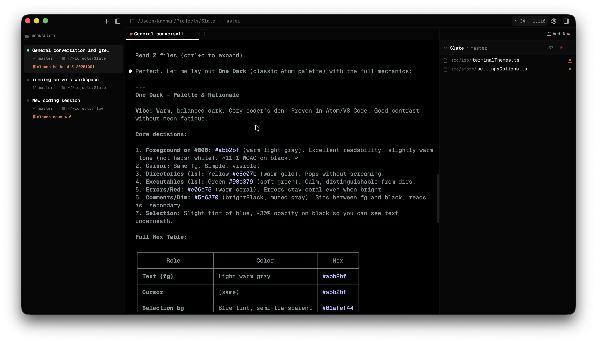
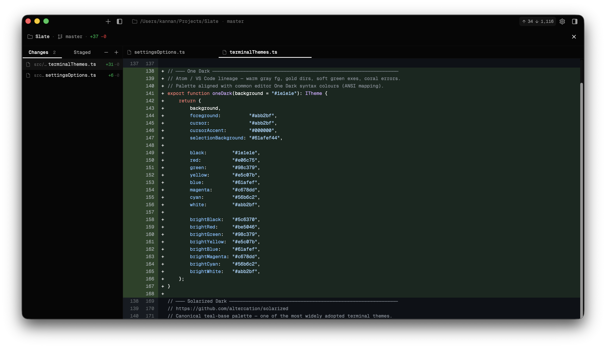
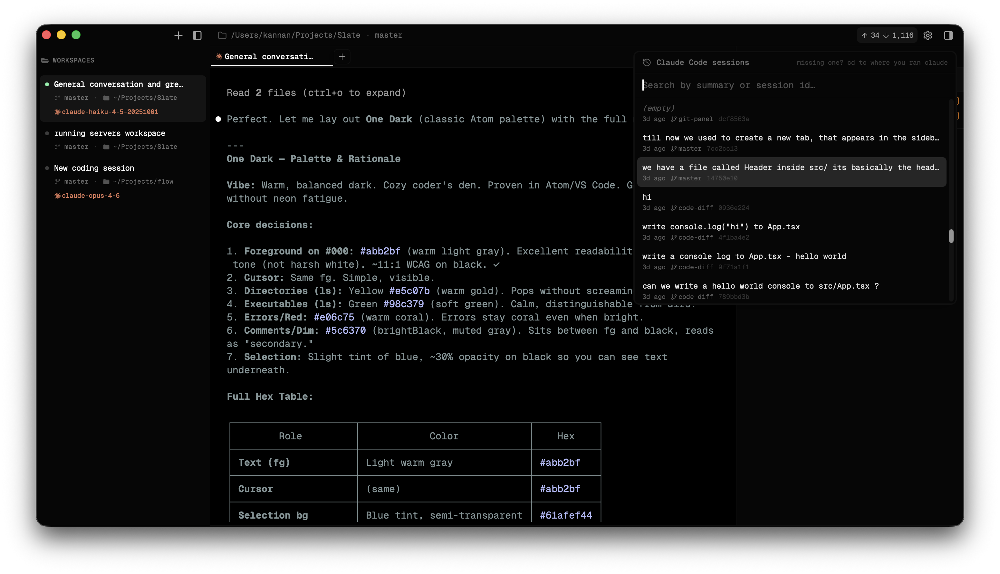
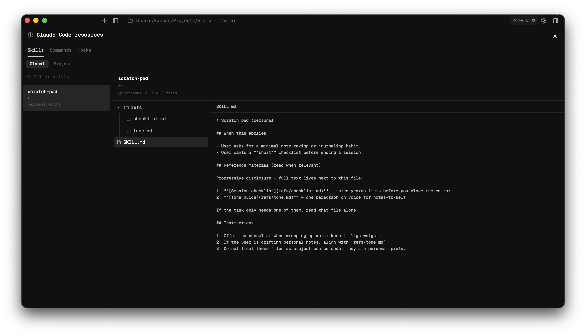
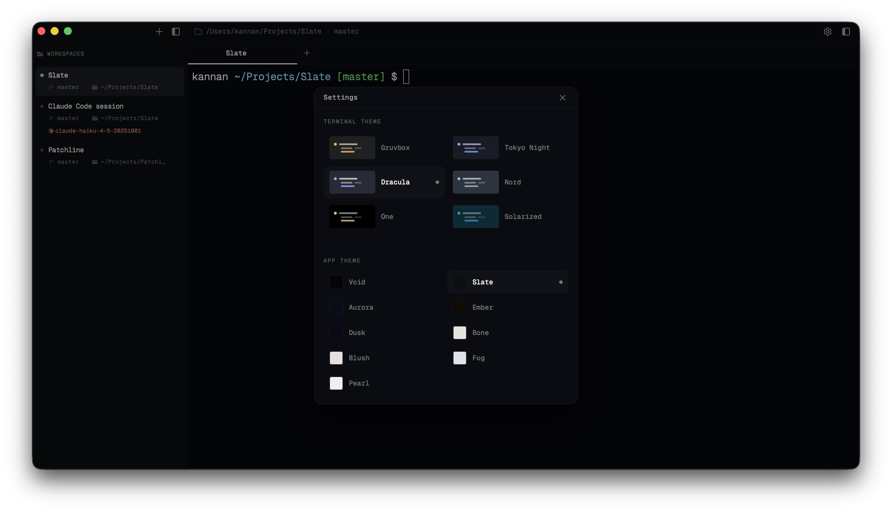

<div align="center">

<br />

# Blackslate

### The terminal built for the agentic developer.

A macOS terminal that feels fast and familiar by default — then **transforms**<br />when Claude Code starts running inside it.

<br />

[](https://www.apple.com/macos/)
[](https://tauri.app)
[](https://react.dev)
[](LICENSE)

<br />

<table><tr><td align="center">
⚠️&nbsp; <strong>Active development</strong> — expect breaking changes between releases.&nbsp; PRs welcome.
</td></tr></table>

<br />

</div>

<!-- ───────────────────────────── SCREENSHOTS ──────────────────────────────── -->

<div align="center">


<p align="center"><em>Workspaces in the sidebar, each with its own horizontal <strong>tabs</strong> — multiple terminals per workspace.</em></p>

<br />


<p align="center"><em>Claude Code running: <strong>input / output tokens</strong> in the title bar, live indicators on tabs and workspaces.</em></p>

<br />


<p align="center"><em><strong>Git panel</strong> with Changes / Staged and a full <strong>diff viewer</strong> for code review.</em></p>

<br />


<p align="center"><em><strong>Resume</strong> past Claude Code conversations from the UI — no IDs to remember.</em></p>

<br />


<p align="center"><em>Browse your Claude <strong>skills</strong>, <strong>slash commands</strong>, and <strong>hooks</strong> in a structured in-app view.</em></p>

<br />


<p align="center"><em>Five terminal themes, ten sidebar palettes — switch live via <code>⌘,</code></em></p>

</div>

<br />

---

## Why

Every terminal treats the agent as just another process printing to a pipe. You spawn Claude Code, it starts working, and now you're scrolling through walls of output trying to remember which session is doing what, what files it touched, which directory that was.

**The tools are powerful. The workspace isn't built for them.**

Blackslate wraps the terminal in an intelligent workspace layer. It doesn't replace the shell — it reads it. When Claude Code is running, the UI surfaces what matters: token usage in the title bar, agent indicators on every tab, git diffs beside your work, and past sessions a click away.

The philosophy: **augment at the UI/UX layer, not at the protocol layer.** PTY, shell, and process management are solved problems. The unsolved problem is the experience of working *alongside* an agent — and that's entirely a UI/UX problem.

---

## Features

<table>
<tr>
<td width="50%" valign="top">

**Workspaces & tabs**

- Multiple **workspaces** in the sidebar — `⌘1`–`⌘9`
- **Horizontal tabs** per workspace — `⌘⌥1`–`⌘⌥9`, `⌘[` / `⌘]`
- **Rename** workspaces (`⌘⇧R`) and tabs (`⌘R`)
- PTYs stay alive — switching is instant, no state loss

</td>
<td width="50%" valign="top">

**Claude Code awareness**

- **Live indicators** on tabs and workspace rows
- **Token usage** (input / output + cache) in the title bar
- **Resume sessions** from a header picker — one click
- Process-tree detection via `tcgetpgrp` + `sysinfo`

</td>
</tr>
<tr>
<td width="50%" valign="top">

**Git & code review**

- Right-side **git panel** — Changes / Staged per repo (`⌘L`)
- **Unified diff viewer** for any changed file
- Stage, unstage, discard from the UI
- Branch + dirty status in sidebar

</td>
<td width="50%" valign="top">

**Claude toolkit**

- Browse **skills**, **slash commands**, and **hooks** in-app
- Structured, readable layout — no CLI digging
- Works with personal (`~/.claude/`) and project (`.claude/`) configs

</td>
</tr>
<tr>
<td width="50%" valign="top">

**Terminal**

- **WebGL-accelerated** xterm.js (same renderer as VS Code)
- **Live cwd** via OSC 7 — no dotfile mutation
- **Project stack** badges (Rust, Go, Node, Python, …)
- Font zoom: `⌘=` / `⌘-`

</td>
<td width="50%" valign="top">

**Personalisation**

- **5 terminal themes** — Gruvbox Dark, Tokyo Night, Dracula, Nord, Solarized Dark
- **10 sidebar palettes** — Void, Carbon, Ember, Aurora, Deep Sea, Toxic, Dusk, Crimson, Rose, Slate
- Settings via `⌘,` — more coming via `blackslate.config`

</td>
</tr>
</table>

---

## Keyboard shortcuts

All shortcuts use **⌘** on macOS.

| Shortcut | Action |
|:---------|:-------|
| `⌘,` | Settings |
| `⌘N` | New workspace |
| `⌘T` | New tab in active workspace |
| `⌘W` / `⌘Q` | Close active tab (confirms if work in progress) |
| `⌘⇧W` | Close active workspace |
| `⌘⇧Q` | Quit Blackslate |
| `⌘R` | Rename active tab |
| `⌘⇧R` | Rename active workspace |
| `⌘1`–`⌘9` | Switch to workspace 1–9 |
| `⌘⌥1`–`⌘⌥9` | Switch to tab 1–9 |
| `⌘[` / `⌘]` | Previous / next tab (wraps) |
| `⌘B` | Toggle sidebar |
| `⌘L` | Toggle git panel |
| `⌘=` / `⌘-` | Zoom font in / out |

---

## Vision

Near-term: the best **Claude Code–native terminal** on macOS.

Longer-term: **a full-stack developer workspace that lives inside the terminal** — an integrated editor, Claude events timeline, splits, composer + model controls, and git actions. Everything for a complete read–edit–run loop without leaving the surface where the agent works. Not Electron. Not a browser tab. A native macOS app built for the workflow of 2025.

---

## Roadmap

Order reflects current priorities. **Test coverage is #1.**

#### Foundation

| # | Feature |
|:-:|:--------|
| **1** | **Test coverage** — Rust backend + React/TS frontend. Safe refactors, regression protection. |
| **2** | **`blackslate.config`** — single user-owned config file for shortcuts, defaults, feature flags, paths. |
| **3** | **Restore workspace on reopen** — persist layout (workspaces, tabs, order, active selection) across quit/relaunch. |

#### Layout & terminals

| Status | Feature |
|:------:|:--------|
| 🔲 | **Reorder** workspaces and tabs (drag-and-drop) |
| 🔲 | **Vertical split** — two terminals stacked |
| 🔲 | **Horizontal split** — two terminals side by side |

#### Claude, composer & git

| Status | Feature |
|:------:|:--------|
| 🔲 | **Message composer + model selection** |
| 🔲 | **Claude events timeline** — tool use, lifecycle, file touchpoints |
| 🔲 | **Commit and push** buttons in the git UI |

#### Further out

| Status | Feature |
|:------:|:--------|
| 🔲 | **Integrated code editor** — read–edit–run without leaving Blackslate |

---

## Tech stack

| Layer | Choice |
|:------|:-------|
| Application shell | **Tauri 2** (Rust) |
| Frontend | **React 19** · TypeScript · Vite 7 |
| Styling | **Tailwind CSS v4** · shadcn/ui |
| Terminal renderer | **xterm.js** + WebGL addon |
| State | **Zustand** |
| PTY backend | **portable-pty** (Rust) |
| Async runtime | **Tokio** |
| Process detection | macOS `proc_pidinfo` · `sysinfo` |

Rust is infrastructure only — PTY lifecycle, process detection, git and project metadata. All parsing, state, and UX logic lives in the React frontend. **Blackslate makes no Anthropic API calls**; it reads Claude Code's output from the PTY stream.

---

## Getting started

**Prerequisites** — macOS 13+, [Rust](https://rustup.rs) stable, [Bun](https://bun.sh) (or Node 20+), Xcode CLI Tools (`xcode-select --install`).

```bash
git clone https://github.com/your-org/blackslate.git
cd blackslate
bun install
```

**Dev** (hot reload — first run compiles Rust, ~1 min; then incremental):

```bash
bun tauri dev
```

**Release** (`.app` + `.dmg` under `src-tauri/target/release/bundle/`):

```bash
bun tauri build
```

---

<details>
<summary><strong>Project structure</strong></summary>
<br />

```
blackslate/
├── src/                            # React frontend
│   ├── components/
│   │   ├── layout/                 # AppLayout — titlebar, sidebar, main pane
│   │   ├── sidebar/                # AppSidebar — session list + metadata
│   │   ├── terminal/               # TerminalPane, TerminalView
│   │   └── settings/               # SettingsDialog
│   ├── hooks/
│   │   └── usePty.ts               # PTY ↔ xterm.js bridge + OSC 7 parser
│   ├── store/
│   │   ├── sessions.ts             # Zustand session store
│   │   └── settings.ts             # Preferences — theme, sidebar colour, font
│   └── lib/
│       ├── terminalThemes.ts       # xterm.js colour theme definitions
│       └── appShortcuts.ts         # Global keyboard shortcut registry
│
└── src-tauri/src/                  # Rust backend
    └── terminal/
        ├── session/                # PtySession, shell cmd builder, PTY reader
        ├── manager.rs              # SessionManager — RwLock concurrent map
        ├── commands/               # Tauri IPC command handlers
        └── agent_detect/           # Claude Code process-tree detection
```

</details>

<details>
<summary><strong>Architecture notes</strong></summary>
<br />

- **Shell integration without dotfile mutation** — OSC 7 cwd reporting is injected at session creation via a temporary `ZDOTDIR` override (zsh) and a `PROMPT_COMMAND` prefix (bash). Your dotfiles are never touched.
- **Agent detection** — `tcgetpgrp` on the PTY master returns the foreground process group; `sysinfo` walks the tree from the shell PID. Both paths are checked, so detection works whether `claude` is a foreground job or a nested subprocess.
- **Event coalescing** — the PTY reader accumulates output for up to 4 ms or 8 KB before emitting a Tauri IPC event. High throughput during agent output bursts; imperceptible latency in interactive use.
- **No xterm.js unmounting** — all `TerminalPane` instances stay mounted at all times. Inactive sessions are hidden with `visibility: hidden`, so xterm keeps measuring container dimensions. Switching is instant with no PTY state loss.
- **PTY concurrency** — `SessionManager` uses `RwLock<HashMap<String, Arc<PtySession>>>` so writes, resizes, and agent checks on different sessions proceed in parallel.

</details>

---

## Contributing

Issues and **pull requests are welcome**. The project is under active development — larger refactors or behaviour changes may land without a long deprecation window. Pin to a release or commit if you need stability.

**Hard constraints:**

- **xterm.js owns all terminal rendering** — never write terminal output to the React DOM
- **All `TerminalPane` instances stay mounted** — `visibility: hidden`, never `display: none`
- **No Anthropic API calls** — Blackslate reads Claude Code's PTY output; it does not call any AI API
- **Business logic belongs in the frontend** — Rust is infrastructure only

---

<div align="center">

**MIT License**

</div>
